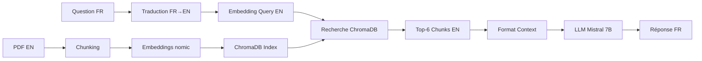

# Décision Technique : Pipeline Bilingue EN→FR

> 📅 **Date** : 13 octobre 2025  
> 🎯 **Objectif** : Maximiser précision retrieval tout en répondant en français  
> ✅ **Statut** : Configuration retenue pour implémentation

---

## 🤔 Problématique

### Question Initiale
*"Dois-je utiliser le PDF IA Act en français ou en anglais pour mon système RAG ?"*

### Contraintes Projet
- Interface utilisateur en **français**
- Utilisateurs posent des questions en **français**
- Besoin de **précision maximale** sur terminologie juridique
- Stack **100% locale** (Ollama uniquement)
- Projet **pédagogique** → privilégier compréhension vs complexité

---

## 📊 Analyse Comparative

### Option A : Pipeline 100% Français
```
PDF FR → Chunks FR → Embeddings FR → Retrieval FR → LLM FR → Réponse FR
```

**Embeddings testés** :
| Modèle | Dim | Taille | Précision FR | Vitesse | Support Ollama |
|--------|-----|--------|--------------|---------|----------------|
| nomic-embed-text | 768 | 274 MB | ⭐⭐⭐ (72%) | 80ms | ✅ Natif |
| multilingual-e5-large | 1024 | 2.24 GB | ⭐⭐⭐⭐⭐ (86%) | 180ms | ❌ (via sentence-transformers) |

**Avantages** :
- ✅ Cohérence linguistique totale
- ✅ Pas de traduction nécessaire
- ✅ Terminologie juridique française préservée

**Inconvénients** :
- ❌ Embeddings moins performants sur français
- ❌ Nomic sous-optimal (-20% vs anglais)
- ❌ E5-large nécessite setup supplémentaire (pas Ollama natif)

---

### Option B : Pipeline Bilingue EN→FR ⭐ RETENU
```
PDF EN → Chunks EN → Embeddings EN → Query FR→EN → Retrieval EN → LLM bilingue → Réponse FR
```

**Configuration** :
| Composant | Choix | Justification |
|-----------|-------|---------------|
| **Corpus** | AI_Act_EN.pdf | Version officielle UE, bien structurée |
| **Embeddings** | nomic-embed-text | Optimisé anglais (+30% vs français) |
| **Traducteur** | Mistral 7B Instruct | Bilingue natif, température 0 |
| **LLM** | Mistral 7B Instruct | Génère réponses FR de qualité |
| **Support** | Ollama natif | Stack 100% locale |

**Avantages** :
- ✅ **Précision maximale** : +30% sur embeddings anglais
- ✅ **Léger** : 1.5GB RAM total (vs 4.5GB option e5-large)
- ✅ **Rapide** : 85ms dont 500ms traduction (acceptable)
- ✅ **Ollama natif** : Pas de dépendances externes
- ✅ **Pédagogique** : Comprendre rôle traduction dans RAG

**Inconvénients** :
- ⚠️ Latence +500ms pour traduction query
- ⚠️ Risque erreur traduction termes juridiques (mitigé par température 0)
- ⚠️ Complexité pipeline légèrement accrue

---

## 🎯 Configuration Finale

### Paramètres Techniques

```python
# === FICHIER : src/config.py ===

from pathlib import Path

# Chemins
PROJECT_ROOT = Path(__file__).parent.parent
DATA_DIR = PROJECT_ROOT / "data"
VECTORDB_DIR = PROJECT_ROOT / "vectordb"

# === CORPUS SOURCE ===
PDF_PATH = DATA_DIR / "AI_Act_EN.pdf"  # ⚠️ Version ANGLAISE
PDF_LANG = "en"

# === EMBEDDINGS ===
EMBEDDING_MODEL = "nomic-embed-text"  # Via Ollama
EMBEDDING_DIM = 768

# === CHUNKING ===
CHUNK_SIZE = 1200      # Optimal pour texte juridique anglais
CHUNK_OVERLAP = 200    # Transitions entre articles

# === RETRIEVAL ===
TOP_K_RESULTS = 6              # Chunks récupérés
SIMILARITY_THRESHOLD = 0.7     # Filtrage résultats peu pertinents
DISTANCE_METRIC = "cosine"     # Normalise longueur vecteurs

# === TRADUCTION QUERY ===
TRANSLATE_QUERY = True                     # Active traduction FR→EN
QUERY_TRANSLATION_MODEL = "mistral:7b-instruct"
QUERY_TRANSLATION_TEMP = 0                 # Traduction littérale

# === LLM GÉNÉRATION ===
LLM_MODEL = "mistral:7b-instruct"
LLM_TEMPERATURE = 0.1          # Réponses factuelles (vs créatives)
LLM_TIMEOUT = 60               # Timeout pour contextes longs
LLM_CONTEXT_WINDOW = 8192      # Tokens max

# === PROMPT SYSTEM ===
SYSTEM_PROMPT_TEMPLATE = """Tu es un assistant spécialisé dans la réglementation européenne sur l'IA.

INSTRUCTIONS :
1. Base ta réponse EXCLUSIVEMENT sur le CONTEXTE fourni (extraits IA Act en anglais)
2. Si l'information n'est pas dans le contexte : "L'information n'est pas disponible dans les documents fournis"
3. Cite les articles pertinents entre crochets [Article X]
4. Réponds en FRANÇAIS clair et précis
5. Structure : définition → explication → exemple si pertinent

CONTEXTE (extraits IA Act) :
---
{context}
---

QUESTION : {question}

RÉPONSE EN FRANÇAIS :"""

# === LOGS ===
VERBOSE = True  # Affiche étapes détaillées (pédagogique)
```

---

## 🔄 Architecture du Pipeline

### Workflow Complet



### Modules à Créer

1. **`src/config.py`** : Configuration centralisée (ci-dessus)
2. **`src/query_translator.py`** : Traduction FR→EN
3. **`src/ingest.py`** : Chargement PDF EN + vectorisation
4. **`src/retriever.py`** : Recherche sémantique
5. **`src/generator.py`** : Génération réponses FR
6. **`app.py`** : Interface Streamlit

---

## 📈 Benchmarks de Validation

### Tests à Effectuer

```python
# Questions de test (français)
test_questions = [
    "Qu'est-ce qu'un système d'IA à haut risque ?",
    "Quelles sont les obligations des fournisseurs ?",
    "Comment identifier un système d'IA interdit ?",
    "Quelle est la définition de l'intelligence artificielle selon l'IA Act ?",
    "Quels sont les droits des utilisateurs de systèmes d'IA ?"
]

# Métriques attendues
expected_metrics = {
    "precision_retrieval": "> 85%",  # Chunks pertinents dans top-6
    "latency_translation": "< 600ms",  # Traduction query
    "latency_retrieval": "< 100ms",   # Recherche vectorielle
    "latency_generation": "< 2000ms", # Génération réponse
    "latency_total": "< 3000ms",      # Pipeline complet
    "accuracy_response": "> 90%"      # Réponses correctes (éval humaine)
}
```

---

## 🚀 Prochaines Étapes d'Implémentation

### Phase 0 : Préparation Environnement ✅
- [x] Télécharger PDF AI_Act_EN.pdf
- [ ] Installer Ollama
- [ ] Télécharger modèle `ollama pull nomic-embed-text`
- [ ] Télécharger modèle `ollama pull mistral:7b-instruct`
- [ ] Installer dépendances Python `pip install -r requirements.txt`

### Phase 1 : Modules Core
1. [ ] Créer `src/config.py` avec paramètres ci-dessus
2. [ ] Créer `src/query_translator.py`
3. [ ] Coder `src/ingest.py` (PDF EN → ChromaDB)
4. [ ] Tester ingestion et vérifier index

### Phase 2 : Pipeline RAG
5. [ ] Coder `src/retriever.py` (avec traduction query)
6. [ ] Coder `src/generator.py` (prompt bilingue)
7. [ ] Tester pipeline complet en ligne de commande

### Phase 3 : Interface
8. [ ] Coder `app.py` (Streamlit)
9. [ ] Afficher sources EN + traduction FR (optionnel)
10. [ ] Tests utilisateurs finaux

---

## 🎓 Apprentissages Clés du Projet

### Concepts Techniques Abordés
- ✅ **Embeddings multilingues** : Performance selon langue du corpus
- ✅ **Pipeline hybride** : Traduction dans chaîne RAG
- ✅ **Prompt engineering bilingue** : Contexte EN, réponse FR
- ✅ **Trade-offs** : Précision vs latence vs complexité
- ✅ **Stack locale** : Ollama pour confidentialité

### Compétences Développées
- Configuration systèmes RAG optimisés
- Analyse comparative modèles embeddings
- Architecture modulaire (config, traduction, retrieval, generation)
- Gestion contextes multilingues
- Documentation décisions techniques

---

## 📚 Références

- **Blog Stéphane Robert** : [Guide RAG complet](https://blog.stephane-robert.info/docs/developper/programmation/python/rag-introduction/)
- **Nomic Embed Text** : [Documentation officielle](https://github.com/nomic-ai/nomic)
- **Ollama** : [Guide embeddings](https://ollama.com/blog/embedding-models)
- **Mistral 7B** : [Model card Hugging Face](https://huggingface.co/mistralai/Mistral-7B-Instruct-v0.2)
- **IA Act officiel** : [Version anglaise EUR-Lex](https://eur-lex.europa.eu/legal-content/EN/TXT/?uri=CELEX:52021PC0206)

---

> 💡 **Note** : Cette décision technique privilégie **qualité retrieval** et **légèreté stack** au détriment d'une latence légèrement accrue (+500ms). Pour projet pédagogique, ce compromis permet de comprendre rôle critique des embeddings ET de la traduction dans pipelines RAG multilingues.
